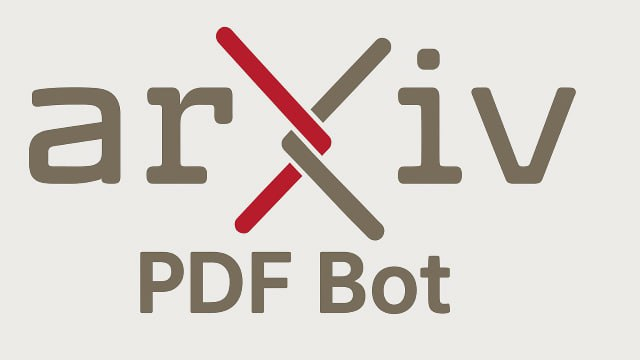

    

🚀 **Welcome to ArxivPDFBot!**  
Your one-stop Telegram companion for downloading research papers directly from arXiv in PDF format.

---

## ✨ Features

- **Instant Access:**  
  Just send an arXiv DOI, a URL like `https://arxiv.org/abs/1508.04319`, or even a paper title, and the bot works its magic to deliver the PDF right into your chat.  

- **Batch Processing:**  
  Got a `.bib` file? No problem! ArxivPDFBot can process multiple entries at once, providing you a streamlined way to collect a library of research papers with real-time progress updates.

- **Real-Time Progress:**  
  The bot gives you live updates every step of the way – from checking your input to searching for the paper and finally downloading the PDF. You'll always know what's happening!
---

## 💡 How It Works

1. **Send Your Query:**  
   Simply type or send a file containing the DOI, URL, or paper title. No commands needed!

2. **Receive the PDF:**  
   Once the paper is found and processed, the PDF is delivered straight to your conversation!

---

## ⚙️ Built With

- **[Python](https://www.python.org/)** for robust backend processing.
- **[aiogram](https://docs.aiogram.dev/)** to interact seamlessly with the Telegram API.
- **[arxiv](https://pypi.org/project/arxiv/)** for querying and downloading papers from arXiv.

---

---

## 🙏 Feedback & Contributions

Feel free to share your thoughts or contribute to the project to make ArxivPDFBot even better. Your feedback is greatly appreciated!

---

Happy researching! 🎓📚  
Stay curious, and let ArxivPDFBot be your gateway to the world of scientific knowledge.